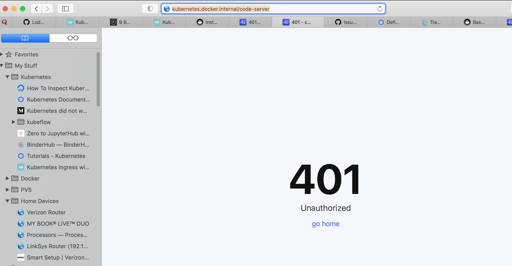
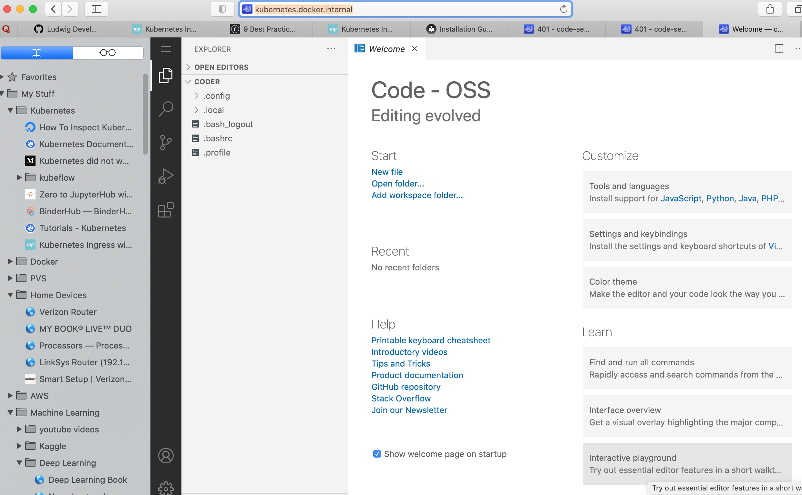

# Code Server on K8S

Experiments in running [codercom/code-server](https://hub.docker.com/r/codercom/code-server) in Docker for Mac Kubernetes cluster.

This work is built on [this example](https://www.digitalocean.com/community/tutorials/how-to-set-up-the-code-server-cloud-ide-platform-on-digitalocean-kubernetes).

### Contents
|File|Description|
|----|-----------|
|code_server_nginx.yaml|k8s manifest file to define code-server resources: namespace, ingress, services, deployments.  Based on nginx ingress controller.|
|ingress_nginx.yaml|k8s manifest to define nginx ingress controller|
|ingress_nginx_demo.yaml|k8s manifest to run a demo utilization the nginx ingress controller|

### Setup
* nginx ingress controller install: https://kubernetes.github.io/ingress-nginx/deploy/#docker-for-mac
* istio ingress controller install: bash script [`istio_setup.sh`](./istio_setup.sh)

### Lessons Learned

#### HTTP 401 error
Specifying a non-trivial path for the coder-server ingress causes a `HTTP 401` error.  This [blog posting](https://airbrake.io/blog/http-errors/401-unauthorized-error) provided the insight to the solution, see the discussion on "Check Requested URL".

**Partial Ingress specification with the error**
``` 
apiVersion: networking.k8s.io/v1beta1
kind: Ingress
...
spec:
  rules:
  - host: kubernetes.docker.internal
    http:
      paths:
      - path: /code-server        #<== This causes the error.
        backend:
          serviceName: code-server-service
          servicePort: 80
```

**Resulting ingress resource**
```
Jim-MacBook-Pro:jim deploy[709]$ kubectl describe ingress -n code-server
Name:             code-server-ingress
Namespace:        code-server
Address:          localhost
Default backend:  default-http-backend:80 (<error: endpoints "default-http-backend" not found>)
Rules:
  Host                        Path  Backends
  ----                        ----  --------
  kubernetes.docker.internal
                              /code-server        code-server-service:80 (10.1.0.72:8080)
                              /code-server/echo   echo-service:5678 (10.1.0.73:5678)
Annotations:                  kubernetes.io/ingress.class: nginx
Events:
  Type    Reason  Age    From                      Message
  ----    ------  ----   ----                      -------
  Normal  CREATE  2m45s  nginx-ingress-controller  Ingress code-server/code-server-ingress
  Normal  UPDATE  2m42s  nginx-ingress-controller  Ingress code-server/code-server-ingress
```


**Test with curl command**
``` 
Jim-MacBook-Pro:jim deploy[713]$ curl -kL http://kubernetes.docker.internal/code-server
<!DOCTYPE html>
<html lang="en">
  <head>
    <meta charset="utf-8" />
    <meta
      name="viewport"
      content="width=device-width, initial-scale=1.0, maximum-scale=1.0, minimum-scale=1.0, user-scalable=no"
    />
    <meta
      http-equiv="Content-Security-Policy"
      content="style-src 'self'; manifest-src 'self'; img-src 'self' data:; font-src 'self' data:;"
    />
    <title>401 - code-server</title>
    <link rel="icon" href="./static/de41646fc402b968ca6d555fdf2da7de9554d28a/usr/lib/code-server/src/browser/media/favicon.ico" type="image/x-icon" />
    <link rel="manifest" href="./static/de41646fc402b968ca6d555fdf2da7de9554d28a/usr/lib/code-server/src/browser/media/manifest.json" crossorigin="use-credentials" />
    <link rel="apple-touch-icon" href="./static/de41646fc402b968ca6d555fdf2da7de9554d28a/usr/lib/code-server/src/browser/media/pwa-icon-384.png" />
    <link href="./static/de41646fc402b968ca6d555fdf2da7de9554d28a/usr/lib/code-server/dist/register.css" rel="stylesheet" />
    <meta id="coder-options" data-settings='{"base":".","csStaticBase":"./static/de41646fc402b968ca6d555fdf2da7de9554d28a/usr/lib/code-server","logLevel":2}' />
  </head>
  <body>
    <div class="center-container">
      <div class="error-display">
        <h2 class="header">401</h2>
        <div class="body">Unauthorized</div>
        <div class="links">
          <a class="link" href="./dashboard">go home</a>
        </div>
      </div>
    </div>
    <script data-cfasync="false" src="./static/de41646fc402b968ca6d555fdf2da7de9554d28a/usr/lib/code-server/dist/register.js"></script>
  </body>
</html>
Jim-MacBook-Pro:jim deploy[714]$
```
**Test with browser**


**Fix to the `HTTP 401` error**

``` 
apiVersion: networking.k8s.io/v1beta1
kind: Ingress
...
spec:
  rules:
  - host: kubernetes.docker.internal
    http:
      paths:
      - path: /                    #<== This fixes the error.
        backend:
          serviceName: code-server-service
          servicePort: 80
```

**Resulting ingress resource**
```
Jim-MacBook-Pro:jim deploy[712]$ kubectl describe ingress -n code-server
Name:             code-server-ingress
Namespace:        code-server
Address:          localhost
Default backend:  default-http-backend:80 (<error: endpoints "default-http-backend" not found>)
Rules:
  Host                        Path  Backends
  ----                        ----  --------
  kubernetes.docker.internal
                              /                   code-server-service:80 (10.1.0.74:8080)
                              /code-server/echo   echo-service:5678 (10.1.0.75:5678)
Annotations:                  kubernetes.io/ingress.class: nginx
Events:
  Type    Reason  Age   From                      Message
  ----    ------  ----  ----                      -------
  Normal  CREATE  21s   nginx-ingress-controller  Ingress code-server/code-server-ingress
  Normal  UPDATE  12s   nginx-ingress-controller  Ingress code-server/code-server-ingress
```


**Test with curl command**
``` 
im-MacBook-Pro:jim deploy[714]$ curl -kL http://kubernetes.docker.internal/
<!DOCTYPE html>
<html lang="en">
  <head>
    <meta charset="utf-8" />
    <meta
      name="viewport"
      content="width=device-width, initial-scale=1.0, maximum-scale=1.0, minimum-scale=1.0, user-scalable=no"
    />
    <meta
      http-equiv="Content-Security-Policy"
      content="style-src 'self'; script-src 'self' 'unsafe-inline'; manifest-src 'self'; img-src 'self' data:; font-src 'self' data:;"
    />
    <title>code-server login</title>
    <link rel="icon" href="./static/de41646fc402b968ca6d555fdf2da7de9554d28a/usr/lib/code-server/src/browser/media/favicon.ico" type="image/x-icon" />
    <link rel="manifest" href="./static/de41646fc402b968ca6d555fdf2da7de9554d28a/usr/lib/code-server/src/browser/media/manifest.json" crossorigin="use-credentials" />
    <link rel="apple-touch-icon" href="./static/de41646fc402b968ca6d555fdf2da7de9554d28a/usr/lib/code-server/src/browser/media/pwa-icon-384.png" />
    <link href="./static/de41646fc402b968ca6d555fdf2da7de9554d28a/usr/lib/code-server/dist/register.css" rel="stylesheet" />
    <meta id="coder-options" data-settings='{"base":".","csStaticBase":"./static/de41646fc402b968ca6d555fdf2da7de9554d28a/usr/lib/code-server","logLevel":2}' />
  </head>
  <body>
    <div class="center-container">
      <div class="card-box">
        <div class="header">
          <h1 class="main">Welcome to code-server</h1>
          <div class="sub">Please log in below. Password was set from $PASSWORD.</div>
        </div>
        <div class="content">
          <form class="login-form" method="post">
            <input class="user" type="text" autocomplete="username" />
            <input id="base" type="hidden" name="base" value="/" />
            <div class="field">
              <input
                required
                autofocus
                class="password"
                type="password"
                placeholder="PASSWORD"
                name="password"
                autocomplete="current-password"
              />
              <input class="submit -button" value="SUBMIT" type="submit" />
            </div>

          </form>
        </div>
      </div>
    </div>
  </body>
  <script data-cfasync="false" src="./static/de41646fc402b968ca6d555fdf2da7de9554d28a/usr/lib/code-server/dist/register.js"></script>
  <script data-cfasync="false" src="./static/de41646fc402b968ca6d555fdf2da7de9554d28a/usr/lib/code-server/dist/login.js"></script>
</html>
```

**Test with browser**


#### URL Target Re-write

With nginx ingress controller proved ability to do uri target re-write.  Re-writing accomplished with the annotation `nginx.ingress.kubernetes.io/rewrite-target: /$1` and use of regular expressions in the `path` specification, e.g.,
```
      - path: /code-server/(.*|$)

      - path: /code-server/(echo)
```

|Original URL|Re-written URL|
|------------|--------------|
|`http://hostname.com/code-server/`|`http://hostname.com/`|
|`http://hostname.com/code-server/echo`|`http://hostname.com/echo`|


```